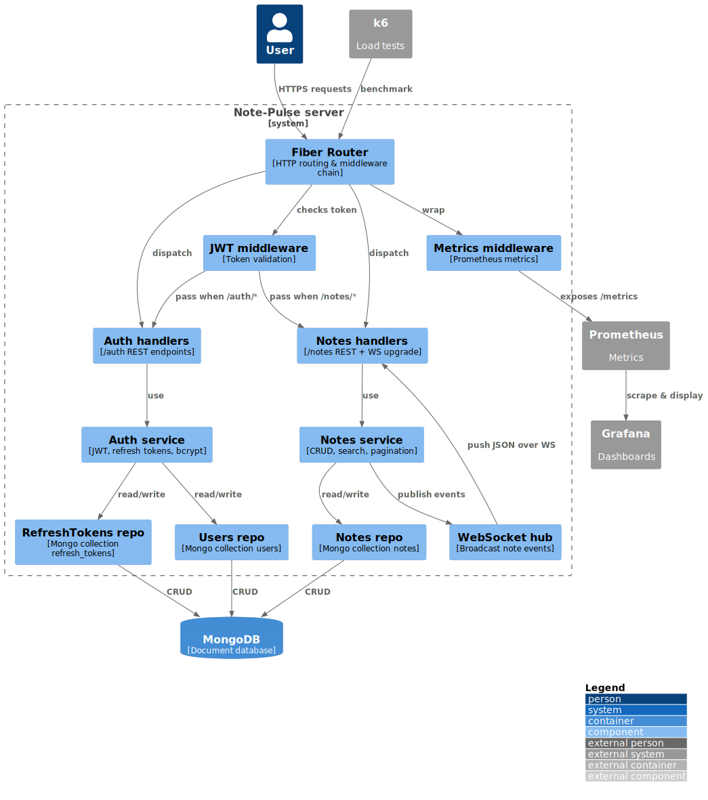

# NotePulse 

Tiny note-taking API with live push updates over WebSocket.

For the detailed functional spec see [`requirements.md`](requirements.md).

## Quick start

```bash
# development stack (Go + MongoDB + Grafana/Prometheus)
make dev
```

The server comes up on [http://localhost:8080](http://localhost:8080); Swagger
UI is at `/docs/index.html`.

Production images are published to GHCR:

```bash
docker pull ghcr.io/joobypm/note-pulse:latest
```

## Configuration

All settings are available as environment variables or a `.env` file:

| Group     | Variable                | Default                 | Notes                                           |
| --------- | ----------------------- | ----------------------- | ----------------------------------------------- |
| Server    | `APP_PORT`              | `8080`                  | HTTP port                                       |
| Logging   | `LOG_LEVEL`             | `info`                  | `debug` `info` `warn` `error`                   |
| MongoDB   | `MONGO_URI`             | `mongodb://mongo:27017` | incl. credentials                               |
| MongoDB   | `MONGO_DB_NAME`         | `notepulse`             | database name                                   |
| Auth JWT  | `JWT_SECRET`            | -                       | min 32 chars                                    |
| Auth JWT  | `ACCESS_TOKEN_MINUTES`  | `15`                    | access token TTL                                |
| Auth JWT  | `REFRESH_TOKEN_DAYS`    | `30`                    | refresh token TTL                               |
| Security  | `AUTH_RATE_PER_MIN`     | `5`                     | per-IP burst limit for auth routes              |
| Security  | `APP_RATE_PER_MIN`      | `0`                     | per-IP burst limit for app routes (except auth) |
| WebSocket | `WS_MAX_SESSION_SEC`    | `900`                   | hard session cap                                |
| WebSocket | `WS_OUTBOX_BUFFER`      | `256`                   | per-conn queue size                             |
| Metrics   | `ROUTE_METRICS_ENABLED` | `true`                  | Prometheus `/metrics`                           |

A ready-to-use development `.env` with secure random secrets is generated by:

```bash
./scripts/gen-dev-env.sh
```

## Architecture



- **Fiber router** applies CORS, rate-limits, Prometheus metrics and JWT
  middleware before dispatching to typed handlers.
- Handlers are thin HTTP/JSON adapters; they delegate all business rules to
  domain services.
- Each service talks to its Mongo repository through a five-second
  circuit-breaker context (`internal/clients/mongo.WithRepoTimeout`).
- `notes.Service` emits `NoteEvent` objects to an in-process **Hub** which fans
  them out to WebSocket clients with back-pressure and drop detection.
- Auth uses stateless HS256 access tokens and short-lived, rotating refresh
  tokens stored in Mongo; rotation downgrades gracefully when the DB runs in
  standalone mode without transactions.
- Observability: Prometheus metrics at `/metrics`, optional pprof at `:6060`,
  and Pyroscope integration guarded by a single flag.

## Testing and CI

- **Unit tests**: `make test`
- **End-to-end tests** run the server plus MongoDB in Testcontainers
  (`make e2e`).
- **Load testing**: `make e2e-bench` spins up the full stack, executes k6
  scripts, and converts JSON summaries to Markdown reports committed into
  `loadtest/reports`.

CI is wired through GitHub Actions (`.github/workflows/ci.yml`) and enforces
`make check` (fmt, vet, lint, tests, build) on every pull request.
